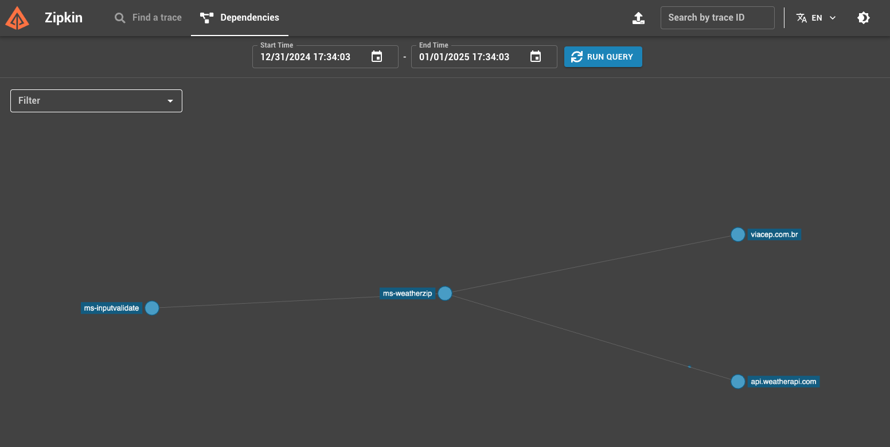
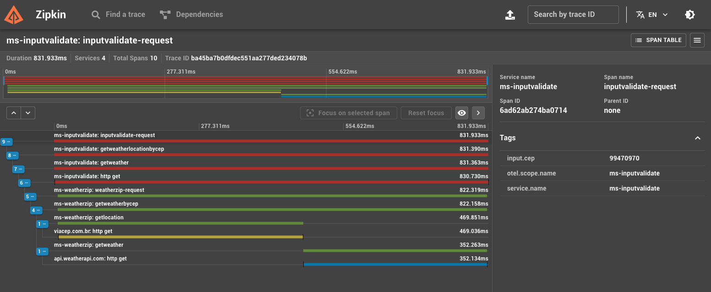

# Observability

> [!IMPORTANT]
> Para poder executar o projeto contido neste repositório é necessário que se tenha o Docker instalado no computador. Para maiores informações siga o site <https://www.docker.com/>

- [Observability](#observability)
  - [Desafio GoLang Pós GoExpert - Observabilidade \& Open Telemetry](#desafio-golang-pós-goexpert---observabilidade--open-telemetry)
    - [Requisitos a serem seguidos](#requisitos-a-serem-seguidos)
      - [Serviço A (InputValidate) \[Responsável pelo INPUT\]](#serviço-a-inputvalidate-responsável-pelo-input)
      - [Serviço B (WeatherZip) \[Responsável pela ORQUESTRAÇÃO\]](#serviço-b-weatherzip-responsável-pela-orquestração)
      - [Entregas](#entregas)
    - [Extras Adicionados](#extras-adicionados)
      - [Suite de Testes](#suite-de-testes)
      - [Documentação da API](#documentação-da-api)
    - [Executando os Serviços](#executando-os-serviços)
    - [Obversabilidade com Open Telemetry + Zipkin](#obversabilidade-com-open-telemetry--zipkin)
      - [Dependencias](#dependencias)
      - [Traces Distribuidos](#traces-distribuidos)
    - [Informações da API](#informações-da-api)
      - [Rotas](#rotas)
      - [Consultando Temperaturas](#consultando-temperaturas)
      - [Verificando a Saúde dos Serviços](#verificando-a-saúde-dos-serviços)

## Desafio GoLang Pós GoExpert - Observabilidade & Open Telemetry

Este projeto faz parte da Pós GoExpert como desafio, nele são cobertos os conhecimentos em http webserver, APIRest, Viper, channels, tratamentos de erros, packages, Clean Architecture, DI, Swagger, Open Telemetry, Spans, Jaeger, Prometheus.

O Desafio consiste em desenvolver uma API em Go Lang, que possua um `endpoint` onde possamos informar um `cep` e através deste, identificarmos a localidade/cidade e retornarmos o nome da localidade juntamente com  a temperatura atual em três escalas termométricas, sendo elas:

- Celsius;
- Fahrenheit;
- Kevin

> Esta API deverá implementar OTEL(Open Telemetry) e Zipkin.

### Requisitos a serem seguidos

Baseado no cenário conhecido _"Sistema de temperatura por CEP"_, denominado de **Serviço B**, será incluído um novo projeto, denominado de **Serviço A**.

#### Serviço A (InputValidate) [Responsável pelo INPUT]

- Deve receber um input de 8 dígitos via POST, através do schema: { "cep": "29902555" }
- Deve validar se o input é válido (contém 8 dígitos) e é uma STRING
  - Caso seja válido, encaminhar a consultar para o **serviço B** via HTTP
  - Caso não seja, deverá retornar:
    - Código HTTP: **422**
    - Mensagem: **invalid zipcode**

#### Serviço B (WeatherZip) [Responsável pela ORQUESTRAÇÃO]

- Deve receber um CEP válido de 8 dígitos;
- Deve realizar a pesquisa de CEP, encontrando a localidade e a partir disso retornar as temperaturas formatadas, nas escalas temométricas: Celsius, Fahrenheit e Kelvin juntamente com o nome da localização;
- Deve responder de forma adequada aos seguintes cenário:
  - No caso de SUCESSO:
    - Código HTTP: **200**
    - Response Body: { "city": "São Paulo", "temp_C": 28.5, "temp_F": 28.5, "temp_K": 28.5 }
  - Em caso de FALHA, onde o CEP não seja válido (formato incorreto)
    - Código HTTP: **422**
    - Response: **invalid zipcode**
  - Em caso de FALHA, onde o CEP informado não seja encontrado
    - Código HTTP: **404**
    - Response: **can not find zipcode**

Após a implementação dos serviços, adicione a implementação do OTEL + ZIPKIN:

- Implementar `tracing` distribuído entre Serviço A (inputValidate) <-> Serviço B (weatherZip)
- Utilizar `span` para medir o tempo de resposta do serviço de busca de CEP e busca de temperatura

> [!TIP]
> Algumas dicas para ajudar no desenvolvimento
>
> - Utilizar serviço de API como [viaCEP](https://viacep.com.br/) ou similar para encontrar a localidade através do **CEP** informado;
> - Uilizar serviço de API como [WeatherAPI](https://www.weatherapi.com/) para consultar as temperaturas atuais da localidade;
> - Fórmula para conversão: Celsius > Fahrenheit (`F = C * 1,8 + 32`)
> - Fórmula para conversão: Celsius > Kelvin (`K = C + 273`)
>
>
> Sendo as letras _F_, _C_ e _K_ respectivamente o seguinte:
>
> - C = _Celsius_;
> - F = _Fahrenheit_;
> - K = _Kelvin_
>
> Para dúvidas sobre como implementar o `OTEL`, você pode consultar [aqui](https://opentelemetry.io/docs/languages/go/getting-started/)\
> Para implementação de `spans`, você pode consultar [aqui](https://opentelemetry.io/docs/languages/go/instrumentation/#creating-spans)\
> Você irá precisar de utilizar um serviço `collector` do OTEL, para isto [clique aqui](https://opentelemetry.io/docs/collector/quick-start/)\
> Para maiores informações sobre o Zipkin, você pode consultar [aqui](https://zipkin.io/)

#### Entregas

- Código-fonte completo da implementação;
- Documentação explicando como executar o projeto em ambiente de desenvolvimento;
- Dockerfile e Docker Compose para execução e validação da aplicação.

### Extras Adicionados

Como sempre gosto de buscar incrementar meus exercícios, aumentando assim as chances de aprender mais, implementei um `endpoint` extra a nossa API onde teremos como resposta, dados sobre a saúde de nosso serviço o famoso `health check`. O mesmo atenderá no seguinte endereço abaixo:

```plain-text
http://localhost:{PORTA_DO_SERVICO}/health
```

> Como teremos dois microsserviços/serviços, então o `endpoint` de `health-check` irá funcionar nas portas `8000` e `8001` respectivamente as portas em que os microsserviços serão levantados a princípio.

E terá como resposta um `payload` bem rico, contendo informações sobre:

- Uso de cpu;
- Uso de memória;
- Horário do servidor;
- Tempo de funcionamento;
- Tempo da requisição.

Abaixo segue um exemplo de como será disponibilizado o `payload` na API

```json
{
    "cpu": {
        "cores": 4,
        "percent_used": [
            37.7,
            34.1,
            30,
            26.7,
        ]
    },
    "memory": {
        "total": 17179869184,
        "used": 13563052032,
        "free": 153239552,
        "available": 3616817152,
        "percent_used": 78.9
    },
    "uptime": "4.990172625s",
    "duration": "342.917µs",
    "status": "pass",
    "message": "Alive and kicking!",
    "time": "2024-12-10T16:56:00-03:00"
}
```

> [!TIP]
> Alguns pontos a serem destacados sobre o Health Check
>
> Caso ocorra falha na obtenção de informações, sejam elas de CPU ou Memória seus respectivos dados serão informados como vázio
> o `status` será retornado como `fail` e o campo `message` será exibido como `Still alive, but not kicking!`, caso contrário todas
> as informações irão preenchidas e o `status` e `message` serão retornados conforme o modelo apresentado logo acima.

#### Suite de Testes

Para executar as suites de testes de ambos os projetos, estando na pasta raiz, basta executar o seguinte comando:

```shell
❯ make tests
```

> As suítes de testes de ambos os projetos serão executadas e relatórios contendo informações tanto referente a execução quanto a taxa de cobertura dos testes serão apresentadas no console. Abaixo seguem os relatórios gerados mais recentes que disponibilizei.

Você deverá ver em sua tela, algo parecido com as informações apresentadas abaixo:

```plain-text
❯ make tests
Running tests for InputValidate...
        github.com/vs0uz4/observability/ms-inputvalidate/cmd/inputvalidate              coverage: 0.0% of statements
        github.com/vs0uz4/observability/ms-inputvalidate/doc/swagger                    coverage: 0.0% of statements
        github.com/vs0uz4/observability/ms-inputvalidate/internal/infra/utils           coverage: 0.0% of statements
?       github.com/vs0uz4/observability/ms-inputvalidate/internal/infra/web/health      [no test files]
?       github.com/vs0uz4/observability/ms-inputvalidate/internal/service/contract      [no test files]
?       github.com/vs0uz4/observability/ms-inputvalidate/internal/usecase/contract      [no test files]
...
```

Caso você queira executar as suítes de testes apenas de um dos projetos, você também pode. Para isto basata você executar um dos comandos disponíveis abaixo:

- Executando suíte de testes do ms-inputvalidate

```shell
❯ make test-inputvalidate
```

- Executando suíte de testes do ms-weatherzip

```shell
❯ make test-weatherzip
```

Abaixo seguem os relatórios de cobertura mais atuais que foram executados.

- [ms-inputvalidate](./ms-inputvalidate/doc/COVERAGE.md)
- [ms-weatherzip](./ms-weatherzip/doc/COVERAGE.md)

#### Documentação da API

Adicionei também a documentação da API utilizando o Swagger, desta forma os `endpoints` de ambos os serviços podem ser testados também diretamente do navegador, através das suas respectivas rotas. Para acessar a documentação dos serviços, basta acessa as seguintes URL's abaixo:

- http://localhost:8000/swagger/ - Para acessar a documentação do serviço A (Input Validate);
- http://localhost:8001/swagger/ - Para acessar a documentação do serviço B (Weather Zip).

### Executando os Serviços

- Inicializando os serviços...

Para executar os serviços e todas as ferramentas necessárias, basta executarmos o seguinte comando abaixo:

```shell
❯ docker-compose up -d
```

Na janela do terminal, você deverá ver uma mensagem parecida com o exemplo abaixo:

```shell
❯ docker compose up -d
[+] Running 4/4
 ✔ Network observability_default  Created                         0.0s 
 ✔ Container zipkin               Healthy                         3.1s 
 ✔ Container ms-weatherzip        Started                         2.8s 
 ✔ Container ms-inputvalidate     Started                         2.8s
```

- Encerrando os serviços

Para encerrar os serviços, estando com os mesmos já inicializados basta que executemos o comando abaixo para iniciar o processo de encerramento dos containers.

```shell
❯ docker-compose down
```

Na janela do terminal, você deverá ver uma mensagem parecida com o exemplo abaixo:

```shell
❯ docker compose down
[+] Running 4/4
 ✔ Container ms-inputvalidate     Removed                           0.2s 
 ✔ Container ms-weatherzip        Removed                           0.1s 
 ✔ Container zipkin               Removed                           2.6s 
 ✔ Network observability_default  Removed                           0.1s 
```

### Obversabilidade com Open Telemetry + Zipkin

Conforme solicitado, implementamos nos fluxos dos serviços, `traces` de forma que tivéssemos informações detalhadas sobre os fluxos, pudessemos medir o tempo de resposta de cada parte, além de facilitar na maunutenção na hora de debugar. A Interface do Zipkin está disponível no endereço abaixo 

```plain-text
 `http://localhost:9411/zipkin/`
```

Ela irá facilitar a consulta e analize dos `traces` implementados. Abaixo seguem algumas telas como evidências do funcionamento dos traces distribuidos.

#### Dependencias


#### Traces Distribuidos


### Informações da API

Os serviços, quando rodando em ambiente de desenvolvimento, irão responder no host `localhost` nas portas `8000` e `8001`, respectivamente, sendo os serviços `inputvalidate` e `weatherzip`.

#### Rotas

As rotas disponíveis nas API's dos serviços, são as seguintes apresentadas na listagem abaixo:

- [http://localhost:8000] (InputValidate | Serviço A) - Valida o Input/CEP e direciona a consulta para WeatherZip

```plaintext
GET /               - Rota raiz, exibe mensagem de saudação (enjoy the silence!);
POST /              - Valida o CEP(INPUT) informado e caso seja válido direciona para serviço de clima;
GET /health         - Verifica saúde do serviço e exibe algumas estatísticas;
GET /swagger/*      - Documentação da API no Swagger 
```

- [http://localhost:8001] (WeatherZip | Serviço B) - Consulta de Clima da Localidade

```plaintext
GET /               - Rota raiz, exibe mensagem de saudação (enjoy the silence!);
GET /health         - Verifica saúde do serviço e exibe algumas estatísticas;
GET /weather/{cep}  - Exibe temperatura e nome de localidade consultada por CEP.
GET /swagger/*      - Documentação da API no Swagger 
```

#### Consultando Temperaturas

**Como consultamos a temperatura de uma determinada localidade?** \
Para consultar o clima de uma localidade, basta você consultar a API através da rota `POST /` do serviço `inputvalidate` que o mesmo irá validar o CEP(input) informado, e caso o mesmo seja válido encaminhará a consulta para a API do serviço `weatherzip`. Caso contrário responderá com uma mensagem informando que o CEP informado é inválido. Exemplos:

**CEP Válido**

Request

```plain-text
curl --request POST \
  --url http://localhost:8000/ \
  --header 'Content-Type: application/json' \
  --header 'Host: localhost:8000' \
  --header 'User-Agent: insomnia/10.1.1' \
  --data '{
    "cep":"99470970"
}'
```

Response [HTTP Status 200]

```json
{
  "city": "Nao-Me-Toque",
  "temp_C": 19.1,
  "temp_F": 66.4,
  "temp_K": 292.23
}
```

**CEP Inválido**

Request

```plain-text
curl --request POST \
  --url http://localhost:8000/ \
  --header 'Content-Type: application/json' \
  --header 'Host: localhost:8000' \
  --header 'User-Agent: insomnia/10.1.1' \
  --data '{
    "cep":"988071723"
}'
```

Response [**HTTP Status 422**]

```plain-text
invalid zipcode
```

**CEP Não Encontrado**

Request

```plain-text
curl --request POST \
  --url http://localhost:8000/ \
  --header 'Content-Type: application/json' \
  --header 'Host: localhost:8000' \
  --header 'User-Agent: insomnia/10.1.1' \
  --data '{
    "cep":"24560352"
}'
```

Response [**HTTP Status 404**]

```plain-text
can not find zipcode
```

#### Verificando a Saúde dos Serviços

Para verificarmos a saúde dos serviços, basta consultar a API do respectivo serviço que queira colher as informações acionando a rota `GET /health` que o mesmo irá responder com as informações sobre sua saúde. Exemplo:

**Health Check InputValidate**

Request

```plain-text
curl --request GET \
  --url http://localhost:8000/health \
  --header 'Content-Type: application/json' \
  --header 'Host: localhost:8000' \
  --header 'User-Agent: insomnia/10.1.1'
```

Response [**HTTP Status 200**]

```json
{
    "cpu": {
        "cores": 2,
        "percent_used": [
            2,
            4
        ]
    },
    "memory": {
        "total": 1073741824,
        "used": 1253376,
        "free": 1066659840,
        "available": 1066659840,
        "percent_used": 0.1
    },
    "uptime": "29.693959ms",
    "duration": "386.071µs",
    "status": "pass",
    "message": "Alive and kicking!",
    "time": "2024-12-13T13:52:52-03:00"
}
```

**Health Check WeatherZip**

Request

```plain-text
curl --request GET \
  --url http://localhost:8001/health \
  --header 'Content-Type: application/json' \
  --header 'Host: localhost:8001' \
  --header 'User-Agent: insomnia/10.1.1'
```

Response [**HTTP Status 200**]

```json
{
    "cpu": {
        "cores": 2,
        "percent_used": [
            2,
            4
        ]
    },
    "memory": {
        "total": 1073741824,
        "used": 1253376,
        "free": 1066659840,
        "available": 1066659840,
        "percent_used": 0.1
    },
    "uptime": "29.693959ms",
    "duration": "386.071µs",
    "status": "pass",
    "message": "Alive and kicking!",
    "time": "2024-12-13T13:52:52-03:00"
}
```
